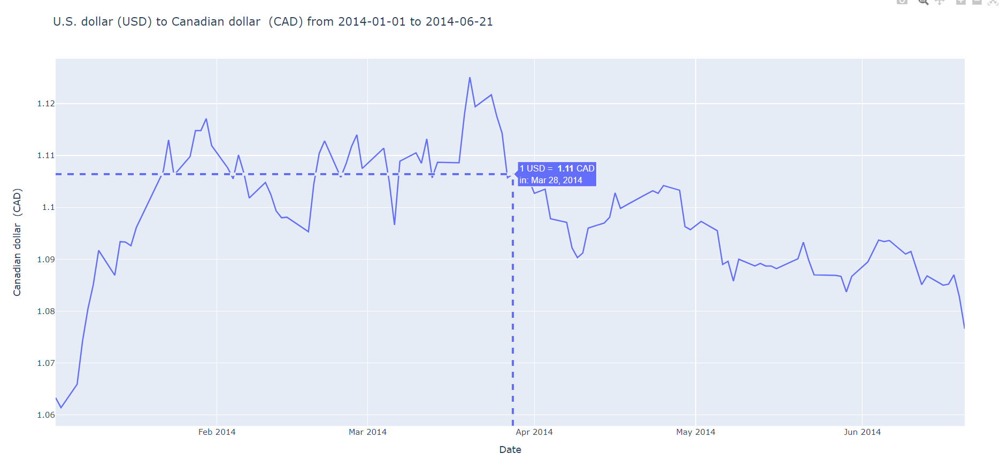
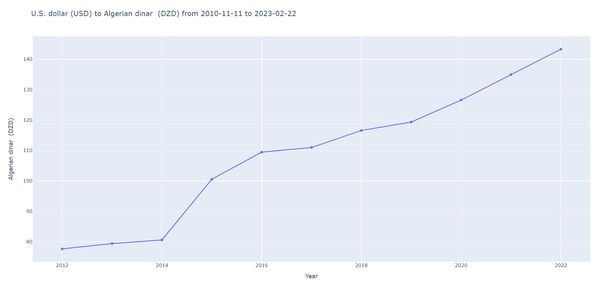

# Amrita-Team3-FXCurrency

An Hackathon project in which we have created a currency converter application using Python backend (Flask and Plotly) with web frontend (HTML, CSS and JS). 

Problem Statement can be seen [here](FX-Currency-ProblemStatement.pdf)

Submission Guidelines can be seen [here](GitHub Submission Guidelines.pdf)

### Instructions to run code:

    git clone https://github.com/xxshubhamxx/Amrita-Team3-FXCurrency

    cd Amrita-Team3-FXCurrency/

    pip3 install -r requirements.txt

    python -u main.py

##### app.py

###### Imports:

    from flask import Flask
    from flask import render_template
    from flask_bootstrap import Bootstrap
    from flask_wtf import FlaskForm
    from wtforms import SubmitField
    from wtforms import SelectField
    from wtforms.fields.html5 import DateField
    import os
    import pandas as pd
    import calendar
    import plotly.express as px

###### Initialising the app:

    app = Flask(__name__)
    app.config['SECRET_KEY'] = 'mysecretkey'
    Bootstrap(app)

###### Utility function to get list of csv files containing data:

    def get_files():
    files = []
    for file in os.listdir(os.path.join(os.getcwd(),"Currency_Conversion_Test_Data")):
        files.append(file)
    return files

###### Utility function to merge data into single dataframe and return it:

    def get_merged_df():
    data = get_files()
    df = pd.read_csv(os.path.join(os.getcwd(),"Currency_Conversion_Test_Data",data[0]))
    data.pop(0)
    for file in data:
        filepath = os.path.join(os.getcwd(),"Currency_Conversion_Test_Data",file)
        df = pd.concat([df, pd.read_csv(filepath)])
    return df

###### Flask Form to take input from the user:

    class NameForm(FlaskForm):
    currency = SelectField(u'Select Currency:', choices=get_merged_df().columns[1:], render_kw={'style': 'width: 30ch; height: 5ch;'})
    start_date = DateField('Enter Start Date', format='%Y-%m-%d', render_kw={'style': 'width: 30ch; height: 5ch;'})
    end_date = DateField('Enter End Date', format='%Y-%m-%d', render_kw={'style': 'width: 30ch; height: 5ch;'})
    interval = SelectField(u'Select Interval:', choices=['daily','monthly','yearly'], render_kw={'style': 'width: 30ch; height: 5ch;'})
    submit = SubmitField('Submit')

###### Functions to get the currency name and code

    def get_cur_str(currency_string):
        currency_string = str(currency_string)
        return currency_string[1:-7]

    def get_cur_code(currency_string):
        currency_string = str(currency_string)
        return currency_string[-4:-1]

###### Decorator to call function in the beginning:

    @app.route('/', methods=['GET', 'POST'])
    def index():

###### Creating the form object and reading storing data to the dataframe and printing initial page:

    form = NameForm()
    df = get_merged_df()

    return render_template('index.html', title='My Form', form=form)

###### If the form is submitted, then we read the data from the form and plot the graph:

    if form.validate_on_submit():
        currency = form.currency.data
        start_date = form.start_date.data
        end_date = form.end_date.data
        interval = form.interval.data
        currency_name = get_cur_str(currency)
        currency_code = get_cur_code(currency)

###### If end date < start date, then warning message is shown:

    if start_date>=end_date:
    return render_template('index.html', form=form, message="Please enter a valid date range")

###### Formating the dataframe by selecting the required columns, dropping null values, mapping date to the required format and setting it as the index of the dataframe:

    df = df[[currency,'Date']]
    df.dropna(inplace=True)
    df['Date'] = pd.to_datetime(df['Date']).dt.date
    df['date'] = df['Date']
    df.set_index('Date', inplace=True)

###### Adding new columns to the dataframe

    df['year'] = pd.DatetimeIndex(df['date']).year
    df['month'] = pd.DatetimeIndex(df['date']).month
    df['month'] = df['month'].apply(lambda x: calendar.month_abbr[x])
    df['month'] = df['year'].astype(str) +", "+ df['month'].astype(str)

###### Selecting the required data from the dataframe and creating title_str for the graph:
    
    df = df[(df['date'] >= start_date) & (df['date'] <= end_date)]
    title_str = f'U.S. dollar (USD) to {currency_name} ({currency_code}) from {start_date} to {end_date}'
        
###### Plotting the graph according to the selected interval:

    if interval == 'daily':
        fig = px.line(df, x='date', y=currency,  labels={'date' : f'Date', currency: f'{currency_name} ({currency_code})' },
            title=title_str)
        
    elif interval == 'monthly':
        year_df=df.groupby('year', as_index=False)[currency].mean()
        month_df=df.groupby('month', as_index=False)[currency].mean()
        month_df = month_df[(month_df['date'] >= start_date) & (month_df['date'] <= end_date)]
        fig = px.line(month_df, x='month', y=currency,  labels={'month' : f'Month' , currency: f'{currency_name} ({currency_code})' },
            title=title_str)
        
    elif interval == 'yearly':
        year_df=df.groupby('year', as_index=False)[currency].mean()
        year_df = year_df[(year_df['date'] >= start_date) & (year_df['date'] <= end_date)]
        fig = px.line(year_df, x='year', y=currency,  labels={'year' : f'Year' , currency: f'{currency_name} ({currency_code})' },
            title=title_str)
        fig.update_traces(mode="markers+lines")
    else:
        return render_template('index.html', form=form, message="Please enter a valid interval")
        
    fig.update_traces(hovertemplate =
    '1 USD = <b> %{y:.2f} </b>'+ f'{currency_code}'+
    ' in: %{x} ')
    fig.update_xaxes(showspikes=True)
    fig.update_yaxes(showspikes=True)

###### Converting the plotly figure to html and rendering it to the template:

    fig.write_html('templates/plot.html',config= {'displaylogo': False})
    return render_template('plot.html')

###### Running the app:
    
        if __name__ == '__main__':
        app.run()

##### index.html:

###### Importing the required bootstrap files

    
    

###### Head block containing css style block

    % block head %}
    {{ super() }}

    
    {{ super() }}
    
    
    

###### Body block containing the code to display error message

    

         
            

                &times; 
                <strong>Warning:</strong> {{message}}
            

        

###### Rest of the body block containing the content and form:

    

        

            

                <h1 class="pt-5 pb-2">Foreign Exchange</h1>

                

                Please choose the filters and currency to compare with USD
                

                {{ wtf.quick_form(form) }}

                
            

        

    

    

##### requirements.txt:

###### This file contains the list of dependencies required by the application

    Flask==1.1.1
    Flask-Bootstrap==3.3.7.1
    jaraco.functools==3.5.1
    Flask-WTF==1.0.0
    pandas==1.3.4
    pandas-datareader==0.10.0
    WTForms==2.3.3
    markupsafe==2.0.1
    itsdangerous==2.0.1
    werkzeug==2.0.3
    openpyxl==3.0.9
    xlrd==2.0.1
    opencv-python==4.5.5.64
    Jinja2==3.0.3
    numpy==1.22.4
    tqdm==4.62.3

##### plot.html:

###### This file is dynamically generated and contains the interactive html graph for final output.

### Outputs:

    
    

### Future Plans:

    - Creating an API to access this user interface.
    - Adding functionality to compare 2 currencies with each other by plotting line graph of their ratio for the selected time period.
    - Creating a component to provide Exchange rate of all currencies with respect to a single base currency by taking ratio of each currency with respect to the base currency.
    - Showing the output graph in the same page and allowing user to change attributes and view the changes in real time.
    - Adding functionality to convert a currency to another currency by taking the exchange rate of the selected currency and multiplying it with the amount entered by the user.
    - Creating a component to display all currencies along with the short code, description, and current exchange rate with respect to USD.
    - Automating uploading of exchange rate data to the database by using a web scheduler.
    